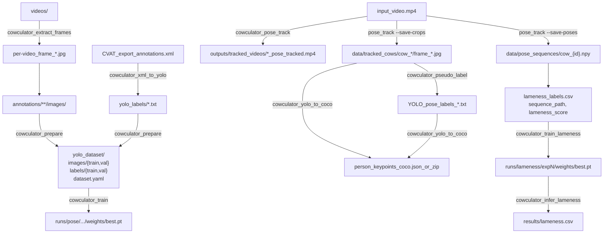

# Cow-culator

Cow pose annotation + training utilities: **CVAT XML ↔ YOLOv8 Pose labels ↔ COCO Keypoints**, plus video pose-tracking and pseudo-labeling.

## Install

```bash
pip install -e .
```

CLI entrypoint:

```bash
cowculator --help
```

## Quickstart (end-to-end)

Assumed repo-default folders:
- `annotations/`: images organized under one or more `*/images/` folders (recursively discovered)
- `yolo_labels/`: flat YOLO pose `*.txt` labels (one per image stem)
- `yolo_dataset/`: generated dataset (`images/{train,val}`, `labels/{train,val}`, `dataset.yaml`)

### 1) Extract images from videos (optional)

```bash
cowculator extract-frames ./videos
```

Notes:
- Extracts ~2 FPS JPEGs into a subfolder per video (`fps=2`, `qscale=2`).
- If `ffmpeg` is missing, the tool attempts OS-specific installation (Linux apt/pacman, macOS brew, Windows static build).

### 2) Convert CVAT XML → YOLO pose labels

Export **CVAT XML for Images 1.1** then:

```bash
cowculator xml-to-yolo --xml ./dataset/annotations.xml --labels-out ./yolo_labels
```

Overwrite existing labels if needed:

```bash
cowculator xml-to-yolo --xml ./dataset/annotations.xml --labels-out ./yolo_labels --overwrite
```

### 3) Prepare `yolo_dataset/`

```bash
cowculator prepare --annotations-dir ./annotations --labels-dir ./yolo_labels --out-dir ./yolo_dataset
```

Use symlinks instead of copies:

```bash
cowculator prepare --annotations-dir ./annotations --labels-dir ./yolo_labels --out-dir ./yolo_dataset --link
```

### 4) Train YOLOv8 Pose

```bash
cowculator train --data ./yolo_dataset/dataset.yaml --model yolov8n-pose.pt --epochs 100 --imgsz 640 --batch 8
```

Or do both steps in one command:

```bash
cowculator prepare-train --annotations-dir ./annotations --labels-dir ./yolo_labels --out-dir ./yolo_dataset --model yolov8n-pose.pt
```

Training outputs are written under `runs/pose/…`. The most recent `runs/pose/**/weights/best.pt` is treated as the default checkpoint by other commands.

## Pipeline diagram



## Video pose tracking (inference) + optional crops

Pose + track + skeleton visualization to an MP4:

```bash
cowculator pose-track -- --video ./path/to/video.mp4
```

Save per-track crops under `data/tracked_cows/`:

```bash
cowculator pose-track -- --video ./path/to/video.mp4 --save-crops
```

Notes:
- Default `--classes 0` assumes your weights are a **single-class cow pose model** (class 0). COCO-pretrained box models use cow class 19; this tool expects a **pose** model.
- Output defaults to `outputs/tracked_videos/<stem>_pose_tracked.mp4`.

## Pseudo-label images with a pose checkpoint

This subcommand is a pass-through wrapper; include `--` before the module flags:

```bash
cowculator pseudo-label -- --images-root ./data/tracked_cows --conf 0.25 --kpt-conf 0.25
```

Write labels to a separate tree:

```bash
cowculator pseudo-label -- --images-root ./data/tracked_cows --output-dir ./pseudo_labels
```

Model resolution:
- `--model <path.pt>`, else latest `runs/pose/**/weights/best.pt`, else `COWCULATOR_MODEL`.

## YOLO pose labels → COCO Keypoints JSON for CVAT import

This subcommand is also pass-through; include `--`:

```bash
cowculator yolo-to-coco -- --images-root ./data/tracked_cows --file-name-style relative
```

Common CVAT import requirements:
- **Frame name matching**: If CVAT items are `cow_1/frame_0` (no extension), use `--file-name-style relative_stem`.
- **Label matching**: `--category-name` must equal the CVAT **skeleton label name** on the task (exact string). Default is `cow`.

Optionally create a CVAT-friendly zip (`annotations/person_keypoints_<subset>.json`):

```bash
cowculator yolo-to-coco -- --images-root ./data/tracked_cows --zip --subset default
```

## Lameness Detection

Lameness detection uses per-track pose keypoint sequences and a bidirectional
GRU classifier to output a [Sprecher locomotion score](https://en.wikipedia.org/wiki/Lameness_(equine)#Scoring)
(1 = normal, 5 = severely lame).

### Step 1 — Collect pose sequences from side-view video

Run `pose-track` with `--save-poses` to persist per-track keypoint arrays:

```bash
cowculator pose-track -- --video ./path/to/side_view.mp4 --save-poses
```

Each tracked cow produces `data/pose_sequences/cow_{id}.npy` — a float32
array of shape `[T, K, 3]` (T frames × K keypoints × {normalised x, y, confidence}).

Optionally specify a custom output directory:

```bash
cowculator pose-track -- --video ./path/to/side_view.mp4 --save-poses --poses-dir ./my_sequences
```

### Step 2 — Label sequences (veterinarian assessment)

Create a CSV following the Sprecher locomotion scale:

| Score | Description |
|-------|-------------|
| 1 | Normal — stands and walks with flat back |
| 2 | Mildly lame — flat back while walking |
| 3 | Moderately lame — arched back while walking |
| 4 | Lame — arched back always, one limb favoured |
| 5 | Severely lame — unable to bear weight on one limb |

```csv
sequence_path,lameness_score
data/pose_sequences/cow_1.npy,1
data/pose_sequences/cow_4.npy,3
data/pose_sequences/cow_7.npy,2
```

Save as e.g. `data/lameness_labels.csv`.

### Step 3 — Train the lameness model

```bash
cowculator train-lameness -- --csv data/lameness_labels.csv --epochs 100 --seq-len 60
```

Key options:

| Flag | Default | Description |
|------|---------|-------------|
| `--seq-len N` | 60 | Frames per sequence window (~2 s at 30 fps) |
| `--hidden N` | 128 | GRU hidden units per direction |
| `--layers N` | 2 | Number of GRU layers |
| `--dropout F` | 0.3 | Dropout probability |
| `--regression` | off | Use MSE regression instead of 5-class softmax |
| `--use-features` | off | Append derived gait features to the keypoint vector (see below) |
| `--normalize` | off | Apply per-sequence z-score normalization before flattening |
| `--lr F` | 1e-3 | AdamW learning rate |
| `--batch-size N` | 16 | Batch size |
| `--device D` | auto | GPU index or `cpu` |
| `--workers N` | 0 | DataLoader workers (0 is safe on Windows) |

Checkpoints are saved to `runs/lameness/expN/weights/best.pt`.

#### Derived gait features (`--use-features`)

When `--use-features` is set, the model's input is extended with 5 biomechanical
features computed per frame from the keypoint array:

| Feature | Description |
|---------|-------------|
| Spine angle | Angle of the neck → tail-head vector (overall back inclination) |
| Spine curvature | Mean angular deviation along the spine chain (arched-back indicator) |
| Hip drop | Vertical asymmetry between left and right hip keypoints |
| Hoof x-range | Horizontal spread of all hoof/ankle keypoints (stride proxy) |
| Mean confidence | Average keypoint detection confidence (quality gate) |

The input size grows from `K×3` to `K×3 + 5`. The features use a 7-keypoint
default skeleton layout (head, neck, withers, mid-back, loin, tail-head,
rear-hoof). For 10-keypoint annotations the extended layout (4 hooves) is
selected automatically based on `K`.

Recommended for most training runs when enough annotated sequences are available:

```bash
cowculator train-lameness -- --csv data/lameness_labels.csv --use-features --normalize --epochs 100
```

#### Per-sequence normalization (`--normalize`)

Z-score normalization is applied per sequence across the temporal dimension
before flattening. This removes cow-size and camera-placement bias, making
training more stable when data comes from multiple sessions or distances.

### Step 4 — Infer on new sequences

```bash
cowculator infer-lameness -- --sequences-dir data/pose_sequences/ --out results/lameness.csv
```

Provide an explicit checkpoint with `--model`:

```bash
cowculator infer-lameness -- --sequences-dir data/pose_sequences/ --model runs/lameness/exp1/weights/best.pt --out results/lameness.csv
```

Output CSV columns: `sequence_path, predicted_score, confidence`.

`confidence` is the softmax probability of the top class (classification mode)
or `NaN` in regression mode.

---

## Body Condition Scoring (BCS)

BCS estimation uses back-view cow crops and an EfficientNet-B0 CNN to output
a score on the [Edmonson scale](https://extension.psu.edu/body-condition-scoring-dairy-cows)
(1.0 = emaciated → 5.0 = obese, in 0.25-step increments).

### Step 1 — Select back-view frames

After running `pose-track --save-crops`, select the best back-view frames per cow:

```bash
cowculator select-bcs-frames -- --crops-dir data/tracked_cows/ --out data/bcs_frames/
```

### Step 2 — Label frames (veterinarian assessment)

Create a CSV with one row per image:

```csv
image_path,bcs_score
data/bcs_frames/cow_1_frame_420.jpg,2.75
data/bcs_frames/cow_2_frame_310.jpg,3.50
```

### Step 3 — Train the BCS model

```bash
cowculator train-bcs -- --csv data/bcs_labels.csv --epochs 100
```

Key options:

| Flag | Default | Description |
|------|---------|-------------|
| `--loss-mode MODE` | `mse` | Loss function: `mse`, `ce`, or `ordinal` (see below) |
| `--warmup-epochs N` | 0 | Epochs to train head-only before unfreezing backbone |
| `--freeze-backbone` | off | Keep backbone frozen for the entire run |
| `--lr F` | 1e-4 | AdamW learning rate (head); backbone gets `lr × 0.1` when unfrozen |
| `--epochs N` | 100 | Training epochs |
| `--batch-size N` | 16 | Batch size |
| `--device D` | auto | GPU index or `cpu` |
| `--workers N` | 0 | DataLoader workers |

Checkpoints are saved to `runs/bcs/expN/weights/best.pt`.

#### Loss modes (`--loss-mode`)

| Mode | Head output | Loss | When to use |
|------|-------------|------|-------------|
| `mse` (default) | 1 neuron | MSELoss | Quick baseline; continuous regression |
| `ce` | 17 neurons | CrossEntropyLoss | Treats each 0.25-step bin as a class |
| `ordinal` | 16 neurons | BCEWithLogitsLoss | Cumulative encoding; best respects the ordinal scale |

Recommended for most training runs:

```bash
cowculator train-bcs -- --csv data/bcs_labels.csv --loss-mode ordinal --warmup-epochs 10 --epochs 100
```

#### Two-stage backbone fine-tuning (`--warmup-epochs`)

`--warmup-epochs N` trains only the classifier head for the first N epochs,
then automatically unfreezes the EfficientNet-B0 backbone with a 10× lower
learning rate. This prevents the pretrained features from being destroyed by
large gradient updates in early training, which is especially important with
small farm datasets.

```bash
# 10 epochs head-only, then full fine-tune for remaining 90
cowculator train-bcs -- --csv data/bcs_labels.csv --warmup-epochs 10 --epochs 100
```

### Step 4 — Infer on back-view images

```bash
cowculator infer-bcs -- --images data/bcs_frames/ --out results/bcs_predictions.csv
```

Per-image output CSV columns: `image_path, cow_id, bcs_score, bcs_rounded`.

#### Multi-frame aggregation (`--aggregate`)

When multiple frames per cow are available (from `select-bcs-frames`), use
`--aggregate` to collapse per-frame scores into a single score per cow:

```bash
# Mean across all frames for each cow_id
cowculator infer-bcs -- --images data/bcs_frames/ --aggregate mean --out results/bcs_predictions.csv

# Median (more robust to outlier frames)
cowculator infer-bcs -- --images data/bcs_frames/ --aggregate median --out results/bcs_predictions.csv
```

`cow_id` is parsed from filenames matching the `cow_N_frame_M.jpg` pattern
produced by `select-bcs-frames`. Frames with no parseable `cow_id` are kept
as individual rows.

## Troubleshooting

Resolved defaults + env overrides:

```bash
cowculator doctor
```

Env overrides (optional):
- `COWCULATOR_MODEL`: path to pose checkpoint (`.pt`) used as default by inference/pseudo-label/pose-track
- `COWCULATOR_ANNOTATIONS_DIR`: overrides default `annotations/`
- `COWCULATOR_LABELS_DIR`: overrides default `yolo_labels/`
