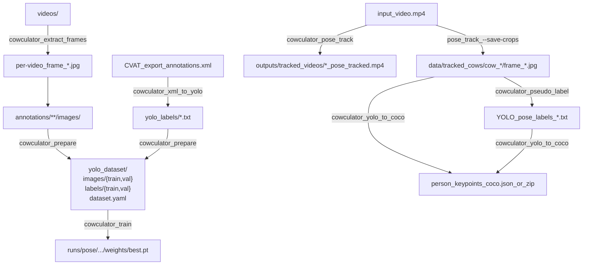

# Cow-culator

Cow pose annotation + training utilities: **CVAT XML ↔ YOLOv8 Pose labels ↔ COCO Keypoints**, plus video pose-tracking and pseudo-labeling.

## Install

```bash
pip install -e .
```

CLI entrypoint:

```bash
cowculator --help
```

## Quickstart (end-to-end)

Assumed repo-default folders:
- `annotations/`: images organized under one or more `*/images/` folders (recursively discovered)
- `yolo_labels/`: flat YOLO pose `*.txt` labels (one per image stem)
- `yolo_dataset/`: generated dataset (`images/{train,val}`, `labels/{train,val}`, `dataset.yaml`)

### 1) Extract images from videos (optional)

```bash
cowculator extract-frames ./videos
```

Notes:
- Extracts ~2 FPS JPEGs into a subfolder per video (`fps=2`, `qscale=2`).
- If `ffmpeg` is missing, the tool attempts OS-specific installation (Linux apt/pacman, macOS brew, Windows static build).

### 2) Convert CVAT XML → YOLO pose labels

Export **CVAT XML for Images 1.1** then:

```bash
cowculator xml-to-yolo --xml ./dataset/annotations.xml --labels-out ./yolo_labels
```

Overwrite existing labels if needed:

```bash
cowculator xml-to-yolo --xml ./dataset/annotations.xml --labels-out ./yolo_labels --overwrite
```

### 3) Prepare `yolo_dataset/`

```bash
cowculator prepare --annotations-dir ./annotations --labels-dir ./yolo_labels --out-dir ./yolo_dataset
```

Use symlinks instead of copies:

```bash
cowculator prepare --annotations-dir ./annotations --labels-dir ./yolo_labels --out-dir ./yolo_dataset --link
```

### 4) Train YOLOv8 Pose

```bash
cowculator train --data ./yolo_dataset/dataset.yaml --model yolov8n-pose.pt --epochs 100 --imgsz 640 --batch 8
```

Or do both steps in one command:

```bash
cowculator prepare-train --annotations-dir ./annotations --labels-dir ./yolo_labels --out-dir ./yolo_dataset --model yolov8n-pose.pt
```

Training outputs are written under `runs/pose/…`. The most recent `runs/pose/**/weights/best.pt` is treated as the default checkpoint by other commands.

## Pipeline diagram



## Video pose tracking (inference) + optional crops

Pose + track + skeleton visualization to an MP4:

```bash
cowculator pose-track -- --video ./path/to/video.mp4
```

Save per-track crops under `data/tracked_cows/`:

```bash
cowculator pose-track -- --video ./path/to/video.mp4 --save-crops
```

Notes:
- Default `--classes 0` assumes your weights are a **single-class cow pose model** (class 0). COCO-pretrained box models use cow class 19; this tool expects a **pose** model.
- Output defaults to `outputs/tracked_videos/<stem>_pose_tracked.mp4`.

## Pseudo-label images with a pose checkpoint

This subcommand is a pass-through wrapper; include `--` before the module flags:

```bash
cowculator pseudo-label -- --images-root ./data/tracked_cows --conf 0.25 --kpt-conf 0.25
```

Write labels to a separate tree:

```bash
cowculator pseudo-label -- --images-root ./data/tracked_cows --output-dir ./pseudo_labels
```

Model resolution:
- `--model <path.pt>`, else latest `runs/pose/**/weights/best.pt`, else `COWCULATOR_MODEL`.

## YOLO pose labels → COCO Keypoints JSON for CVAT import

This subcommand is also pass-through; include `--`:

```bash
cowculator yolo-to-coco -- --images-root ./data/tracked_cows --file-name-style relative
```

Common CVAT import requirements:
- **Frame name matching**: If CVAT items are `cow_1/frame_0` (no extension), use `--file-name-style relative_stem`.
- **Label matching**: `--category-name` must equal the CVAT **skeleton label name** on the task (exact string). Default is `cow`.

Optionally create a CVAT-friendly zip (`annotations/person_keypoints_<subset>.json`):

```bash
cowculator yolo-to-coco -- --images-root ./data/tracked_cows --zip --subset default
```

## Troubleshooting

Resolved defaults + env overrides:

```bash
cowculator doctor
```

Env overrides (optional):
- `COWCULATOR_MODEL`: path to pose checkpoint (`.pt`) used as default by inference/pseudo-label/pose-track
- `COWCULATOR_ANNOTATIONS_DIR`: overrides default `annotations/`
- `COWCULATOR_LABELS_DIR`: overrides default `yolo_labels/`
